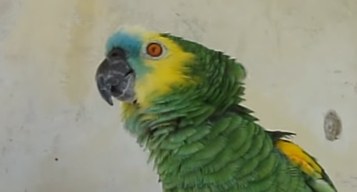
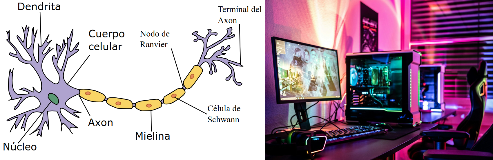

<!-- _class: lead -->
<!-- _footer: Jorge Dueñas Lerín - Universidad Politécnica de Madrid -->

# Grandes modelos del lenguaje 📖⏳

---

# ¿Cuánto tiempo tardarías en leer este libro? 📖⏳

* **Edad 15-18 años**: Entre 200 y 250 ppm 🧑‍🎓
* **Cuentos de la Alhambra**:
    - Palabras: 115 000 📝
    - Fichero en texto: 700 KBytes 💾
* **Total**: 460 minutos -> 7.5 horas sin parar ⏱️

---

## ¿Sabías que hay modelos de lenguaje que han "leído" millones de libros? 🤯📚

* **GPT-3**: Procesó alrededor de 570 GB de texto en 2020
    - ¡Equivalente a cientos de miles de libros! 📚
    * 6 368 064 años de lectura continua 📖🕰️
* **Modelos actuales**:
    - Claude, Gemini, ChatGPT... 🤖
    - Han leído aún más datos para comprender mejor el lenguaje humano. 🧠

---

## ¿Cómo leen tan rápido?

### La "ventana de contexto" 🧐

- Cuando leemos, podemos recordar las últimas palabras y frases para entender la historia y el contexto. 🧩

"*Alguien dejó su paraguas en la sala. Espero que **regrese** a buscar**lo**.*"

* ¿Quién regresa? ¿Qué o a quién busca? 🤔

---

## ¿Cómo leen tan rápido?

 

**¿Cuántas palabras pensáis que puede mirar a la vez?** 🤔

---

## La ventana de contexto 🔍

* **Tamaño de ventana** varía según el modelo:
    - Comienzo 2096, ahora entre 32 768 y 1 000 000 tokens 🔢
    * **Claude** un modelo de Anthropic:
        - 200 000 tokens
        - 150 000 palabras
        - 500 páginas 📚📚📚
* ¡Cada palabra con el contexto de **500 páginas**! 😲

---

## Entonces, ¿qué es un Modelo de Lenguaje de Gran Tamaño (LLM)? 🤔

- Es como un **loro gigante** que ha leído todo Internet… pero en vez de repetir, aprende patrones para crear respuestas nuevas. 🦜💬
- No entiende como un humano, pero reconoce patrones y genera respuestas basadas en **probabilidades**. 🎲 [Ramón 1](https://www.youtube.com/watch?v=Vu5gyw4RJGk#t=10s) [Ramón 2](https://www.youtube.com/watch?v=Vu5gyw4RJGk#t=70s)

---

## Entonces, ¿qué es un Modelo de Lenguaje de Gran Tamaño (LLM)? 🤔

- **No piensa, sino calcula probabilidades**:
    - Si dices *"Hola, ¿cómo..."*
    - el modelo calcula que lo más probable es que sigas con 🤖➡️🗨️
    - *"estás?"*

---

## ¿Cómo aprenden? 🧠💡

- **Inspiración en el cerebro humano** 🧠
- **Redes neuronales artificiales** 🔗

---

## ¡Pero son MULTIMODALES! 🎨🎵🎥

**Ejemplo**: Ahora no solo procesan texto, también imágenes, voz o videos. ¡Como si el loro supiera pintar cuadros o cantar! 🦜🖼️🎤

**¿Deberían llamarse de otra forma?** 🤔

---

## ¿Qué harías si tuvieras un robot superinteligente? 🤖💡

- Que me haga un resumen de historia. 📚
- Que cree memes personalizados. 🖼️😂
- Que me explique cómo resolver ecuaciones con canciones de Bad Bunny. 🎶🧑‍🎤
- Que hable con mi perro. 🐶🗨️

---

## ¿Sabías que los LLMs están cerca de hacer todo eso? 😲

- Pueden **ayudarte** con tareas escolares. 📖📝
- Generar imágenes y memes. 🖼️😂
- **Explicar** conceptos complejos de formas creativas. 🎨🧠
- ¡Pero aún no pueden hablar con tu perro... todavía! 😉🐕
- **Esta tecnología tiene pocos años. Todos estamos aprendiendo.** 🆕

---

## ¿Cómo podemos aprender a usar esta nueva tecnología? 🛠️

- Experimentando con herramientas. ¡Hay muchas! 🧪🖥️
- Siendo críticos con la información que generan. 🧐
- Aprendiendo sobre ética y uso responsable de la IA. ⚖️

* **Errores graciosos**: A veces inventan datos (alucinan), como decir que los pingüinos son mamíferos voladores. 😅🐧

* **Riesgos serios**: Deepfakes (videos falsos), sesgos en respuestas, adicción a chatbots. 🚨🎭

---

## ¡Gracias por tu atención! 🙌

* **Predicción**:

    - Pronto los LLMs serán como asistentes 24/7: ayudarán en clases, crearán videojuegos o hasta diagnosticarán enfermedades. ⏳🧑‍🏫🎮🩺

* **Mensaje final**:
    - ¡Podéis  ser los que programen estos modelos! 👩‍💻👨‍💻
    - ¿Qué os gustaría inventar? 💡🚀
